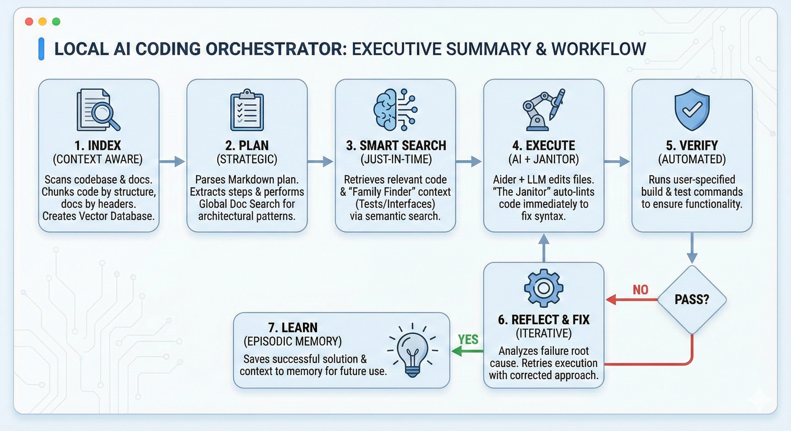
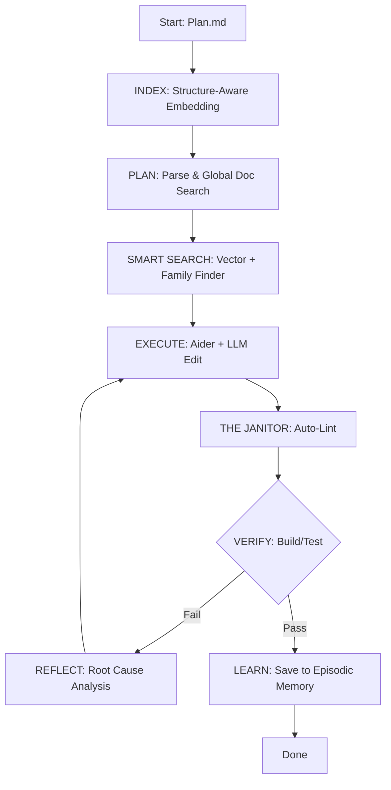

# 🤖 Local AI Coding Orchestrator

**Your personal AI coding assistant that works completely offline.**
 
*No API keys. No cloud dependencies. No data leaks.*

[Why This Exists](#-why-this-exists) • [Features](#-key-features-v20) • [How It Works](#-architecture--workflow) • [Quick Start](#-quick-start)

---

## 📖 Overview

Stop copy-pasting code from ChatGPT and hoping it works. This orchestrator **actually understands your codebase**, **verifies its own work**, and **learns from its mistakes**—all running 100% locally on your machine.

## ❓ Why This Exists

Traditional AI coding tools force a compromise between convenience and security. The Local AI Orchestrator solves the "Trilemma" of AI coding:

| The Problem | The Solution |
| :--- | :--- |
| ☁️ **Privacy Nightmare** Sending proprietary code to the cloud. | **100% Local Execution** Runs on Docker + Ollama. Your IP never leaves your LAN. |
| 🧩 **Integration Hell** Generating code without project context. | **Semantic Search (RAG)** Vector-embedded understanding of your specific architecture. |
| 🐛 **Debugging Nightmare** AI generates code that doesn't compile. | **Self-Verification Loop** The agent runs builds/tests and fixes its own errors before finishing. |

---

## ✨ Key Features (v2.0)

It's like having a junior developer who works 24/7 for free, but never forgets instructions.

### 📚 Documentation-First Intelligence
The agent performs **Semantic Documentation Search** before every task.
* **Global Context:** Scans `Architecture.md` for high-level patterns before planning.
* **Just-In-Time Context:** Pulls up `TestingGuidelines.md` automatically when writing tests.

### 🔗 Smart Context (The "Family Finder")
Heuristic analysis links related files automatically. If you edit `UserService.cs`, the agent auto-loads:
* `IUserService.cs` (The Contract)
* `UserServiceTests.cs` (The Usage)
* *Result: No more hallucinating methods that don't exist.*

### 🧹 "The Janitor" (Auto-Linting)
Generative AI often misses semicolons or indentation.
* **The Janitor** runs immediately after every edit (e.g., `dotnet format`).
* It silently fixes syntax errors *before* the compiler sees them, saving massive amounts of retry time.

---

## 🏗️ Architecture & Workflow

The system utilizes a feedback loop driven by episodic memory and vector embeddings.

Tech Stack
Orchestrator: Python 3.12 (Workflow Engine)

Vector DB: PostgreSQL + pgvector (Semantic Memory)

Agent: Aider + Ollama (DeepSeek Coder v2)

🚀 Quick Start
Prerequisites
Docker Desktop (Running)

Ollama (Download)

1. Model Setup
Pull the recommended stable/efficient models:

Bash
ollama pull deepseek-coder-v2      # The Coding Brain
ollama pull nomic-embed-text       # The Vector Search (Low VRAM)
2. Network Configuration
Allow Docker to access your host Ollama instance.

Windows (PowerShell):

PowerShell
setx OLLAMA_HOST "0.0.0.0"
# Restart Ollama from taskbar
Mac/Linux:

Bash
launchctl setenv OLLAMA_HOST "0.0.0.0"
pkill ollama && ollama serve
3. Installation
Bash
# Clone the repo
git clone <your-repo-url>
cd local-ai-coding-orchestrator

# Build the container
docker-compose build

# Start the database
docker-compose up -d vectordb
💻 Usage
Step 1: Write a Plan
Create a Markdown file (e.g., add_login.md) describing your goal. Tip: Be specific with verification commands.

Markdown
# Goal: Implement user login endpoint

## Context
We're building a REST API. Follow `CodingStandards.md` patterns.

## Steps
1. Create `UserLoginRequest` DTO.
   - Verification: dotnet build

2. Create `AuthService` with JWT generation.
   - Verification: dotnet build

3. Add unit tests for invalid credentials.
   - Verification: dotnet test --filter "AuthServiceTests"
Step 2: Run the Orchestrator
Bash
# Basic run
docker-compose run --rm orchestrator python -m orchestrator.main add_login.md

# Force re-index (Use if you added new documentation)
docker-compose run --rm orchestrator python -m orchestrator.main add_login.md --reindex
Step 3: Review
The agent modifies your files directly.

Bash
git diff
⚙️ Configuration
Low VRAM Mode (Stability)
We recommend nomic-embed-text to prevent OOM crashes when running alongside large coding models.

Edit orchestrator/config.py:

Python
OLLAMA_MODEL = "deepseek-coder-v2"
EMBEDDING_MODEL = "nomic-embed-text" # Small, fast, highly accurate
EMBEDDING_DIM = 768                # CRITICAL: Must match model dimensions
⚠️ Important: If you change EMBEDDING_DIM, you must reset the database:

Bash
docker-compose down -v
docker-compose up -d vectordb
🛡️ Troubleshooting

 
<strong>HTTP Error 500 during indexing</strong>

Cause: Ollama ran out of VRAM while generating embeddings. Fix: Ensure config.py is using nomic-embed-text. The indexer also has a built-in "breather" (1s pause) between chunks.

 
<strong>"No documentation found"</strong>

Cause: Vector search confused by mixed content types. Fix: The system now uses SQL-level filtering (WHERE file_path LIKE '%.md') to ensure documentation searches always return actual docs.

 
<strong>Build/test commands fail inside Docker</strong>

Cause: Missing dependencies in the container. Fix: Mount your local caches in docker-compose.yml:

YAML
volumes:
  - .:/workspace
  - ~/.nuget:/root/.nuget  # Cache .NET packages
  - ~/.npm:/root/.npm      # Cache Node packages

📜 License
Copyright © 2026. All Rights Reserved. This is proprietary software made available for viewing and educational purposes only.

For licensing inquiries, please contact jason.usack@gmail.com.